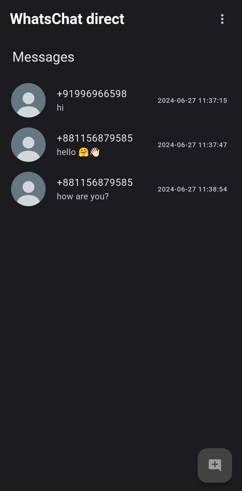
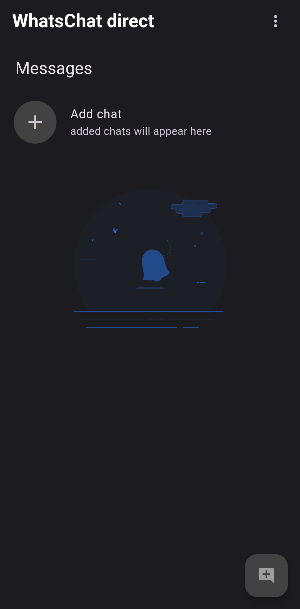

# WhatsChat Direct


## Overview

WhatsChat Direct is a Flutter application that allows users to open WhatsApp chats without saving the contact number. It also provides the functionality to save numbers for quick access, enhancing the user's WhatsApp messaging experience.

 &nbsp; 

## Features

- **Open WhatsApp Chat**: Quickly initiate chats without saving numbers.
- **Save Contacts**: Store frequently contacted numbers for easy access.
- **User-friendly Interface**: Intuitive design for seamless navigation.

## Getting Started

### Prerequisites

- Flutter SDK
- Android Studio / Xcode
- Emulator or physical device

### Installation

1. Clone the repository:

   ```bash
   git clone https://github.com/dracxi/whatschat_direct.git
   ```
2. Navigate into the project directory:
   ```bash
   cd whatschat_direct
   ```
3. Install dependencies:
   ```bash
   flutter pub get
   ```
## Building the App

### Android

To build the Android APK file, use the following command:

```bash
   flutter build apk --release
```
### IOS

To build the iOS app for release, use the following command:

```bash
   flutter build ios --release
```

### Contributing

Contributions are welcome! Fork the repository and submit a pull request or open an issue if you have suggestions or found a bug.

## License

This project is licensed under the MIT License. See the [LICENSE](LICENSE) file for details.